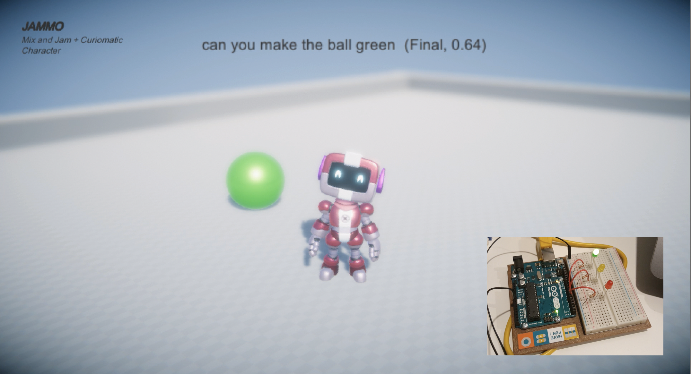

# Unity_Arduino_Speech2Text
This is a basic example on how to integrate a Unity character, Watson Speech to Text Service and Arduino. 
 
YouTube Demo: 

How to replicate: 
1. Clone the repository 
2. Open the Unity Project "UnityArduinoSTT" in Unity (use Unity Hub)
3. Add the Watson Speech to Text Instance credentilas (API Key and URL)
4. Upload the "Traffic-Light.ino" Script to your Arduino
5. Update the Serial Port with your Arduino Port in the "Example Streaming" Script as shown in step 3.3 . Just replace "/dev/tty.usbmodemxxxxxx" with your serial port of your Arduino. 
6. PLAY!

You are good to go! 

Blog: Complete Instruction <a href = "https://www.erikaagostinelli.com/post/unity-character-powered-by-speech-to-text-arduino">"Unity Character powered by Speech to Text & Arduino" </a>

Author: <a href="https://www.linkedin.com/in/erikaagostinelli/">Erika Agostinelli </a>

